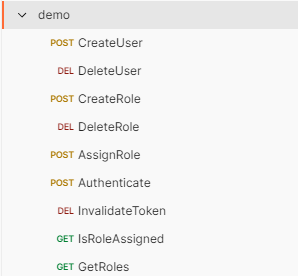

# README

This rest api server can provide basic functions of user/role management and the authentication. It can be launched directly from IntelliJ.

The token is now UUID. If in the future we need more features like including expiry date inside the token or more complicated app pre-auth scenarios like RBAC, we can switch to use JWT.

Refer to demo.postman_collection.json for all apis examples.



### API Docs

## User Controller

### Create User

The method is used to create user. No argument check yet.

Response types:

```201``` If the user is successfully created

```409``` If the user is already existed.

#### Request
- Method: **POST**
- URL:  ```/project/v1/users```
- Headers： N/A
- Body:
```
{
  "username": "mockUsername",
  "password": "12345678"
}
```

#### Response
- Body
```
{
  "code": 201,
  "data": "The user was successfully created."
}
```

### Delete User

The method is used to delete user. No argument check yet.

Response types:

```200``` If the user is successfully deleted

```404``` If the user is not found.

#### Request
- Method: **DELETE**
- URL:  ```/project/v1/users/{username}}```
- Headers： N/A
- Body: N/A

#### Response
- Body
```
{
  "code": 200,
  "data": "The user was successfully deleted."
}
```
## Role Controller

### Create Role

The method is used to create role. No argument check yet. The role only has name field.

Response types:

```201``` If the role is successfully created

```409``` If the role is already existed.

#### Request
- Method: **POST**
- URL:  ```/project/v1/roles```
- Headers： N/A
- Body:
```
{
  "name": "admin"
}
```

#### Response
- Body
```
{
  "code": 201,
  "data": "The role was successfully created."
}
```

### Delete Role

The method is used to delete role. No argument check yet.

Response types:

```200``` If the role is successfully deleted

```404``` If the role is not found.

#### Request
- Method: **DELETE**
- URL:  ```/project/v1/roles/{name}}```
- Headers： N/A
- Body: N/A

#### Response
- Body
```
{
  "code": 200,
  "data": "The role was successfully deleted."
}
```

### Assign Role To User

The method is used to assign role to user. No argument check yet.

Response types:

```200``` If the role is successfully assigned to the user or if the user already has the role.

```404``` If the role is not found or if the user is not found.

#### Request
- Method: **POST**
- URL:  ```/project/v1/roles/{name}}```
- Headers： N/A
- Body
```
{
  "username": "mockUsername"
}
```

#### Response
- Body
```
{
  "code": 200,
  "data": "The role is successfully assigned."
}
```

## Auth Controller

### Authenticate

The method is used to authenticate the user. Should return authToken (UUID) if the username and the password match. No limitation to the token count per user yet.

Response types:

```200``` If the token is successfully generated.

```401``` If the user not existed or username and password don't match.

#### Request
- Method: **POST**
- URL:  ```/project/v1/auth```
- Headers： N/A
- Body
```
{
  "username": "mockUsername",
  "password": "12345678"
}
```

#### Response
- Body
```
{
  "code": 200,
  "data": "bf2fcd14-471b-11ee-be56-0242ac120002"
}
```

### Invalidate Token

The method is used to invalidate the token immediately.

Response types:

```200``` If the token is successfully invalidated.

```401``` If the token is invalid.

#### Request
- Method: **DELETE**
- URL:  ```/project/v1/auth```
- Headers： N/A
- Body
```
{
  "id":"bf2fcd14-471b-11ee-be56-0242ac120002"
}
```

#### Response
- Body
```
{
  "code": 200,
  "data": "The token is invalidated."
}
```

### Is Role Assigned

The method is used to check if the role is assigned to the user.

Response types:

```200``` If the token is valid. The response data should be either true or false.

```401``` If the token is invalid.

#### Request
- Method: **GET**
- URL:  ```/project/v1/auth/roles/{roleName}```
- Headers： N/A
- Body
```
{
  "id":"bf2fcd14-471b-11ee-be56-0242ac120002"
}
```

#### Response
- Body
```
{
  "code": 200,
  "data": true
}
```

### Get User Roles

The method is used to get all roles assigned to the user.

Response types:

```200``` If the token is valid. The response data includes the role list.

```401``` If the token is invalid.

#### Request
- Method: **GET**
- URL:  ```/project/v1/auth/roles```
- Headers： N/A
- Body
```
{
  "id":"bf2fcd14-471b-11ee-be56-0242ac120002"
}
```

#### Response
- Body
```
{
  "code": 200,
  "data": {
    "admin": {
        "name": "admin"
    }
  }
}
```